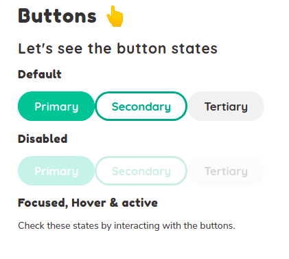

# Momo UI - Design System

The _Comic relief_ design system for any UI framework. Yes, we're framework agnostic :)

Our goal is to create a design system that is lightweight and appealing to the eye and contrasts with the situations that the person may be experiencing. As a result we want the people to have a fun and quiet experience 😌

It looks something like this:

## Get involved

We're still working hard to make momo-ui grow and be available for anyone. If you'd like to contribute designing or coding, please get in touch! yelis124@gmail.com

## Usage License

The idea is that anyone can use this design system in their projects, as long as the result source code is open to the public. We use the GNU GENERAL PUBLIC LICENSE Version 3.
